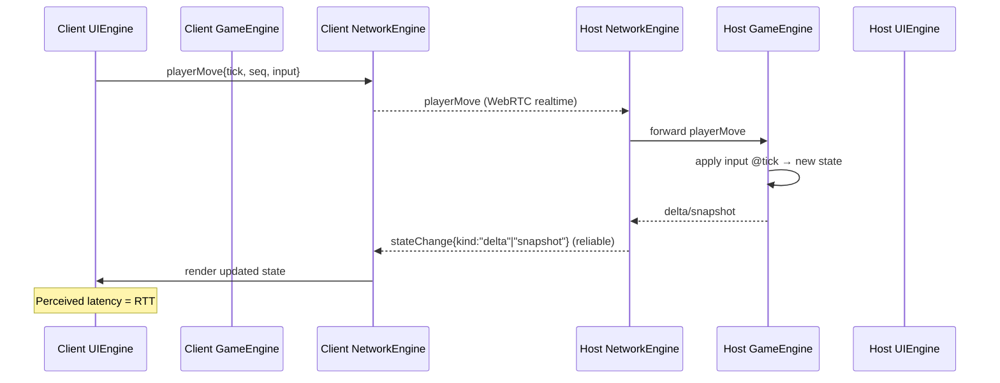

# Minimal Event Model and Flow

## Event Model (2 messages)

### 1. `playerMove` (client → host, realtime/unreliable)
Client inputs sent at tick rate.

```json
{
  "t": "playerMove",
  "tick": 1234,
  "seq": 17,
  "playerId": "p2",
  "input": { "dx": -1, "dy": 0, "actions": ["jump"] }
}
```

- Sent frequently, small payloads.
- Carries `tick` + `seq` for ordering/deduplication.
- Host validates and applies to authoritative state.

---

### 2. `stateChange` (host → client, control/reliable)
Authoritative updates, multiplexed by `kind`.

```json
{
  "t": "stateChange",
  "tick": 1236,
  "kind": "delta",       // "snapshot" | "lobby" | "start" | "end" | "pause" | "resume" | "system"
  "baseTick": 1232,
  "changes": [ /* diff */ ],
  "fullState": null,
  "meta": { "reason": null }
}
```

- **Kinds:**  
  - `delta`: regular sim updates.  
  - `snapshot`: periodic full state.  
  - `lobby`, `start`, `end`, `pause`, `resume`: lifecycle.  
  - `system`: version info, errors, rate limits, etc.  
- Provides recovery (snapshots + deltas).

---

## Flow Variants

### A) Thin Client (Baseline)
1. Client UIEngine → input → NetworkEngine → send `playerMove`.  
2. Host NetworkEngine → Host GameEngine → apply input.  
3. Host GameEngine → produces state → Host NetworkEngine sends `stateChange`.  
4. Client NetworkEngine → Client UIEngine → render.  

**Pros:** Simple.  
**Cons:** High latency feel (RTT for every action).

---

### B) Client-Side Prediction + Reconciliation (Recommended)
1. Client UIEngine → on input:  
   - Predict via Client GameEngine immediately.  
   - Send `playerMove` through NetworkEngine.  
2. Host applies input → authoritative state → sends `stateChange`.  
3. Client GameEngine reconciles:  
   - Rewind/reapply unacked inputs.  
   - Smooth or snap corrections.  
4. Client UIEngine renders continuously.  

**Pros:** Low perceived latency, responsive controls.  
**Cons:** Slightly more complexity (prediction + reconciliation).

---

### C) Deterministic Lockstep
- Clients send only inputs.  
- Host orders inputs, broadcasts them back.  
- Both sides simulate identically.  

**Pros:** Very bandwidth-light.  
**Cons:** Input delay or desync risk. Best for turn-based/strategy.

---

### D) Rollback (Advanced, GGPO-style)
- Clients predict remote inputs.  
- On late arrival, rollback N frames and replay.  

**Pros:** Near-instant feel, great for twitch games.  
**Cons:** Complex (state save/restore, determinism required).

---

### E) Snapshot Interpolation (No Prediction)
- Host sends frequent snapshots.  
- Client interpolates between them.  

**Pros:** Simple client, smooth visuals.  
**Cons:** Feels delayed unless paired with prediction for local player.

---

## Recommendation
- Start with **Flow A** for prototyping.  
- Move to **Flow B** (prediction + reconciliation) for production.  
- Consider **Flow D** only for genres that demand sub-frame precision (fighters, platformers).  


---

## Sequence Diagrams

### Flow A — Thin Client (Baseline)


### Flow B — Client Prediction + Reconciliation (Recommended)
```mermaid
sequenceDiagram
    participant CUI as Client UIEngine
    participant CGE as Client GameEngine
    participant CNET as Client NetworkEngine
    participant HNET as Host NetworkEngine
    participant HGE as Host GameEngine

    CUI->>CGE: predict(input) (instant feedback)
    CUI->>CNET: playerMove{tick, seq, input}
    CNET-->>HNET: playerMove (realtime)
    HNET->>HGE: forward playerMove
    HGE->>HGE: authoritative simulate @tick
    HGE-->>HNET: delta (or snapshot)
    HNET-->>CNET: stateChange{kind:"delta", baseTick, tick, changes}
    CNET->>CGE: reconcile(delta)
    CGE->>CGE: optional rewind & replay unacked inputs
    CGE-->>CUI: corrected state for rendering
    Note over CUI,CGE: Controls feel immediate; minor corrections on reconcile
```

### Optional — Resync Request (Within 2‑message model)
```mermaid
sequenceDiagram
    participant CGE as Client GameEngine
    participant CNET as Client NetworkEngine
    participant HNET as Host NetworkEngine
    participant HGE as Host GameEngine

    CGE->>CNET: playerMove{input:{type:"resync", fromTick}}
    CNET-->>HNET: playerMove (resync request)
    HNET->>HGE: snapshot @latest
    HGE-->>HNET: state snapshot
    HNET-->>CNET: stateChange{kind:"snapshot", tick, fullState}
    CNET->>CGE: load snapshot; resume with future deltas
```
